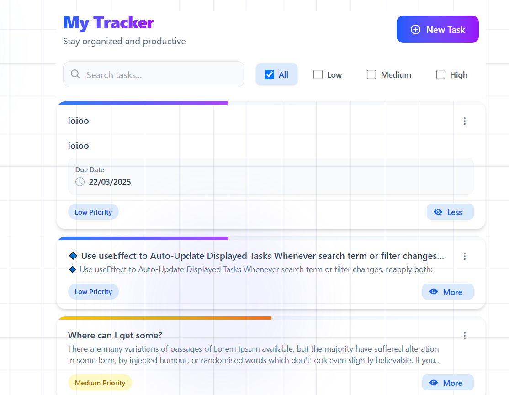
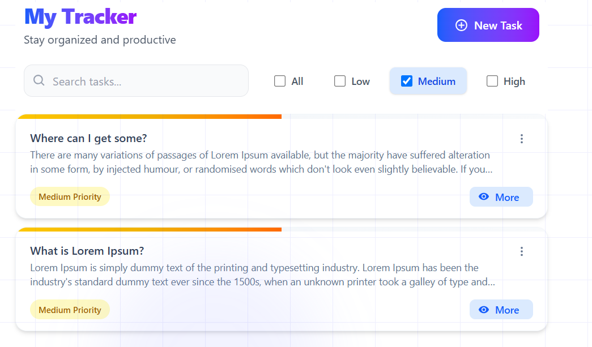
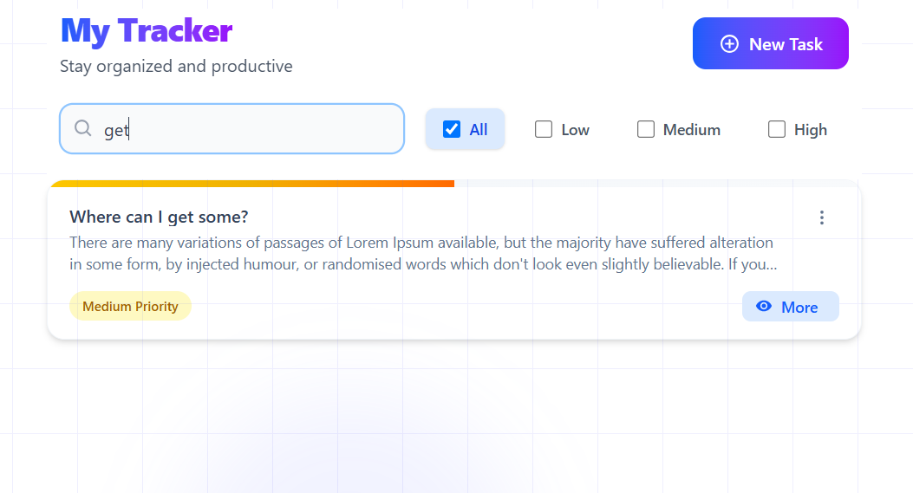

Here's your **README.md** file for your **My  Tracker** project, covering setup instructions, code quality, Git workflow, and CI/CD pipeline.

---

### 📌 **My Tracker**  
_A lightweight task management application with filtering, search, and local storage persistence._

  

## 🚀 **Project Overview**  
**My  Tracker** is a minimalistic task tracker built with **React, TypeScript, and the Context API**. It allows users to add, edit, and delete tasks, filter by priority, and persist data using **localStorage**.  

### 🎯 **Core Features**  
✅ **Task Management:** Create, update, and delete tasks  
✅ **Priority Filter:** Filter tasks by Low, Medium, and High priority  
✅ **Search Functionality:** Search tasks dynamically as you type (with debounce)  
✅ **Data Persistence:** Tasks are stored in **localStorage**  
✅ **Global State Management:** Uses **Context API** for tasks and filters  
✅ **Testing:** Unit tests for core components using **Vitest**  
✅ **Modern UI:** Styled with Tailwind CSS  

---

## ⚡ **Getting Started**  

### **1️⃣ Clone the Repository**  
```sh
git clone https://github.com/pehjos/task-tracker.git
cd task-tracker
```

### **2️⃣ Install Dependencies**  
```sh
yarn install
```

### **3️⃣ Run the Development Server**  
```sh
yarn dev
```
Open [http://localhost:5173](http://localhost:5173) to see the app.

### **4️⃣ Run Tests**  
```sh
yarn test
```

### **5️⃣ Lint & Fix Issues**  
```sh
yarn lint
yarn lint:fix
```

### **6️⃣ Build for Production**  
```sh
yarn build
```

---

## 🏗 **Project Structure**
```
my-task-tracker/
src/
│── assets/            # Static assets like images, icons, fonts
│── components/        # React components (UI elements)
│── context/           # Context API for global state management
│── tests/             # Unit tests for components and logic
│── types/             # TypeScript type definitions
│── utils/             # Utility functions (helpers, formatters, localStorage functions)
│── App.tsx            # Root component of the application
│── index.css          # Global styles
│── main.tsx           # Application entry point (ReactDOM rendering)
│── setupTests.ts      # Test setup file for Vitest/Jest
│── vite-env.d.ts      # Vite environment types
│── .gitattributes     # Git attributes configuration
│── .gitignore         # Ignored files for Git
│── cache.txt          # (Possibly temporary file, can be ignored)
│── eslint.config.js   # ESLint configuration for code quality
│── index.html         # Main HTML template file
│── package.json       # Project dependencies and scripts
│── README.md          # Documentation for the project
│── tsconfig.app.json  # TypeScript config for the app
│── tsconfig.json      # Base TypeScript configuration
│── tsconfig.node.json # TypeScript config for Node-related tasks
│── vite.config.ts     # Vite configuration file
```

---

## 🛠 **Code Quality & Best Practices**
This project follows strict **ESLint** rules with **TypeScript support**, enforcing **clean, maintainable, and bug-free** code.  

### ✅ **Code Rules & Enforced Standards**
```json
"rules": {
  "semi": ["error", "always"], // Enforces the use of semicolons at the end of statements. Missing semicolons will cause an error.
  "quotes": ["error", "double"], // Requires the use of double quotes for strings. Using single quotes will trigger an error.
  "react/react-in-jsx-scope": "off", // Disables the rule that requires React to be in scope when using JSX. This is useful in newer React versions where it's not needed.
  "react/prop-types": "off", // Disables enforcement of prop-types validation, which is unnecessary when using TypeScript.
  "@typescript-eslint/no-explicit-any": "error", // Disallows the use of the `any` type in TypeScript. This helps maintain strong typing.
  "@typescript-eslint/explicit-module-boundary-types": "error", // Requires functions exported from modules to have explicitly defined return types.
  "@typescript-eslint/explicit-function-return-type": "error", // Requires all functions to explicitly specify their return type to improve code clarity.
  "no-console": ["error", { "allow": ["warn", "error"] }], // Prevents `console.log` usage but allows `console.warn` and `console.error`.
  "@typescript-eslint/no-unused-vars": ["error", { "argsIgnorePattern": "^_", "varsIgnorePattern": "^_" }], 
  // Prevents unused variables from being declared. However, variables prefixed with `_` are ignored.
  "@typescript-eslint/no-unused-expressions": ["error", { "allowShortCircuit": true, "allowTernary": true }]
  // Disallows unused expressions (like `a && b` without assignment), but allows short-circuiting and ternary expressions.
}

```
### ✅ **Pre-commit Hooks with Husky**
- Runs **ESLint & Tests** before commits  
- Ensures high-quality code is pushed to the repository  

---

## 🏆 **Git Workflow & Branching Strategy**
**Git best practice workflow** to ensure clean and manageable code.

### 🔄 **Branching Strategy**
- `main` → Stable production-ready branch  
- `develop` → Ongoing development work  
- `feature/*` → New features (merged into `develop`)   

### 📜 **Git Commit Guidelines**
✅ **Small, Focused Commits** – Each commit should address **one** change  
✅ **Descriptive Commit Messages** – Example:
```
feat: added priority filter for tasks
fix: fixed issue with task search debounce
refactor: optimized task storage with useMemo
```

---

## 🔄 **CI/CD Pipeline: Automated Testing & Linting**
This project includes a **CI/CD pipeline** with **GitHub Actions** to automate linting & testing.

### ✅ **Pipeline Overview**
1️⃣ **Runs on push/pull requests** to `main` and `develop`  
2️⃣ **Installs dependencies** (`yarn install`)  
3️⃣ **Runs ESLint** to check code quality  
4️⃣ **Runs Tests** (`yarn test`) to ensure functionality  

### 📝 **GitHub Actions Workflow (`.github/workflows/ci.yml`)**
```yaml
name: CI Pipeline

on:
  push:
    branches:
      - main
      - develop
  pull_request:
    branches:
      - main
      - develop

jobs:
  lint-and-test:
    name: 🔍 Lint & Test
    runs-on: ubuntu-latest

    steps:
      - name: 🛎 Checkout repository
        uses: actions/checkout@v4

      - name: ⚙️ Set up Node.js
        uses: actions/setup-node@v4
        with:
          node-version: 18
          cache: "yarn"

      - name: 📦 Install dependencies
        run: yarn install --frozen-lockfile

      - name: 🚨 Run ESLint
        run: yarn lint

      - name: 🧪 Run Tests
        run: yarn test
```

---

## 🎨 **UI**
### 🌟 **Home Page**


### 📝 **Task List & Filters**


---

## 💡 **Approach & Technical Decisions**
- **React + TypeScript** for **type safety & maintainability**
- **Context API** for **global state management**
- **useState & useEffect** for **state handling**
- **Vitest** for **unit testing**
- **Debounce in Search Input** for **better UX**
- **Husky & ESLint** for **code quality enforcement**


## 📜 **License**
This project is licensed under the **MIT License**.  


### **🔗 GitHub Repository**  
👉 [https://github.com/pehjos/task-tracker](https://github.com/pehjos/task-tracker)  

---
